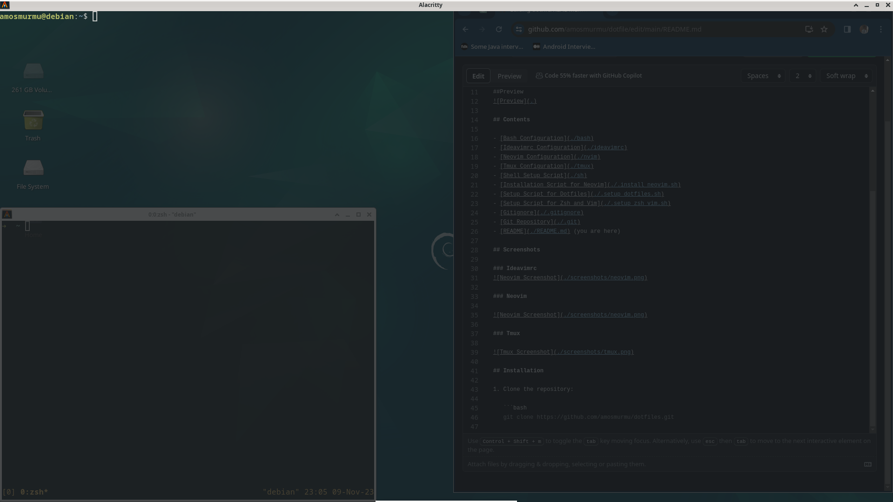

### Dotfiles

These are my personal dotfiles for configuring various tools and applications. Feel free to explore and use anything you find useful.

[](./LICENSE.txt)
[](https://github.com/amosmurmu/dotfile/commits/main)
[](https://github.com/amosmurmu/dotfiles/stargazers)
[](https://github.com/amosmurmu/dotfile/network/members)
[](https://github.com/amosmurmu/dotfile/issues)

### Preview


## Contents

- [Bash Configuration](./bash)
- [Ideavimrc Configuration](./ideavimrc)
- [Neovim Configuration](./nvim)
- [Tmux Configuration](./tmux)
- [Shell Setup Script](./sh)
- [Installation Script for Neovim](./.install_neovim.sh)
- [Setup Script for Dotfiles](./.setup_dotfiles.sh)
- [Setup Script for Zsh and Vim](./.setup_zsh_vim.sh)
- [Gitignore](./.gitignore)
- [Git Repository](./.git)
- [README](./README.md) (you are here)

## Screenshots

### Ideavimrc


### Neovim


### Tmux



## Installation

1. Clone the repository:

   ```bash
   git clone https://github.com/amosmurmu/dotfile.git


## License

This project is licensed under the MIT License - see the [LICENSE](./LICENSE.txt) file for details.
